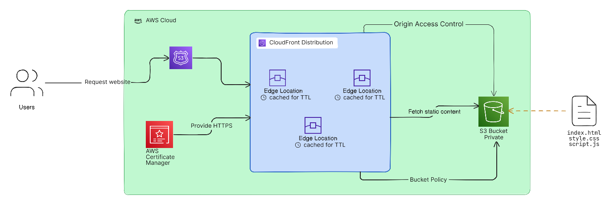
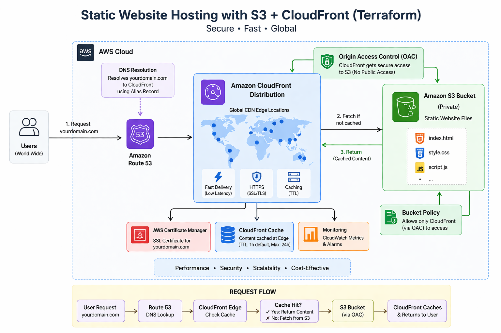
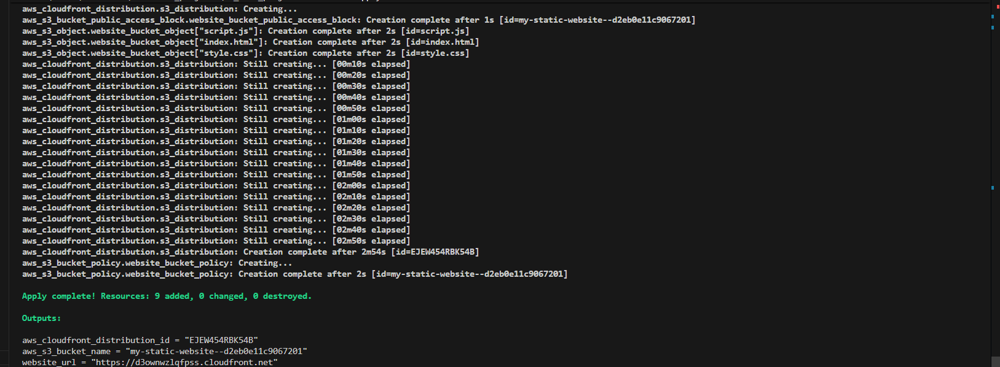
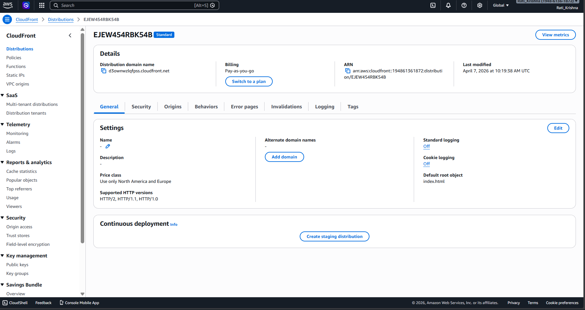

# Static Website Hosting (Mini Project 01)

## 🎯 Project Overview

This mini project demonstrates how to deploy a static website on AWS using Terraform. We'll create a complete static website hosting solution using S3 for storage and CloudFront for global content delivery.

## 🏗️ Architecture

```
Internet → CloudFront Distribution → S3 Bucket (Static Website)
```




## ⚙️ How It Works

1. User requests the website.
2. Route53 (DNS) routes the request to CloudFront.
3. CloudFront checks cache:
   - If cached → returns response.
   - If not cached → fetches from S3.
4. S3 bucket is private and only accessible via CloudFront (OAC).
5. CloudFront caches content based on TTL.
6. HTTPS is enabled using AWS Certificate Manager.

### Components:
- **S3 Bucket**: Hosts static website files (HTML, CSS, JS)
- **CloudFront Distribution**: Global CDN for fast content delivery
- **Public Access Configuration**: Allows public reading of website files

## 📁 Project Structure

```
project/
├── main.tf           # Main Terraform configuration
├── variables.tf      # Input variables
├── outputs.tf        # Output values
├── provider.tf       # Provider configuration
├── backend.tf        # Backend configuration
├── env/              # Environment-specific variables
│   ├── dev.tfvars    # Development environment variables
│   ├── staging.tfvars# Staging environment variables
│   └── prod.tfvars   # Production environment variables
├── www/                # Website source files
│   ├── index.html      # Main HTML page
│   ├── style.css       # Stylesheet
│   └── script.js       # JavaScript functionality
└── .github/workflows/  # CI/CD pipeline configurations
    ├── deploy.yml      # CI/CD pipeline for automatic deployments
    └── destroy.yml     # CI/CD pipeline for automatic destruction

```

## 🚀 Features

### Website Features:
- **Modern Responsive Design**: Works on desktop and mobile
- **Dark/Light Theme Toggle**: Switch between themes (saves preference)
- **Interactive Elements**: Click counter, status updates
- **AWS Branding**: Professional layout showcasing AWS services
- **Animations**: Smooth transitions and loading effects

### Infrastructure Features:
- **S3 Static Website Hosting**: Reliable file storage and serving
- **CloudFront CDN**: Global content delivery with HTTPS
- **Proper MIME Types**: Correct content-type headers for all files
- **Public Access**: Secure public read access configuration

## 🛠️ Prerequisites

1. **AWS CLI** configured with appropriate credentials
2. **Terraform** installed (version 1.0+)
3. **AWS Account** with sufficient permissions for:
   - S3 bucket creation and management
   - CloudFront distribution creation
   - IAM policies for S3 public access

## 📋 Deployment Steps

### 1. Initialize Terraform
```bash
cd terraform_projects/01_mini_project
terraform init
```

### 2. Review the Plan
```bash
terraform plan
```

### 3. Deploy Infrastructure
```bash
terraform apply
```
Type `yes` when prompted to confirm deployment.

### 4. Access Your Website
After deployment completes, Terraform will output the CloudFront URL:
```
website_url = "https://d3ownwzlqfpss.cloudfront.net"
```

## 📊 Resources Created

| Resource Type | Purpose | Count |
|---------------|---------|-------|
| S3 Bucket | Website hosting | 1 |
| S3 Bucket Policy | Public read access | 1 |
| S3 Objects | Website files (HTML, CSS, JS) | 3 |
| CloudFront Distribution | Global CDN | 1 |
| and More | and More | and More |

## 🔧 Configuration Details

### S3 Configuration:
- **Bucket naming**: Auto-generated with prefix `my-static-website-`
- **Website hosting**: Enabled with `index.html` as default
- **Public access**: Configured for read-only public access
- **Content types**: Proper MIME types for web files

### CloudFront Configuration:
- **Origin**: S3 bucket regional domain
- **Caching**: Standard web caching (1 hour default TTL)
- **HTTPS**: Automatic redirect from HTTP to HTTPS
- **Global**: Available worldwide (PriceClass_100)

## ⚙️ Results




## 🧹 Cleanup

To destroy all resources and avoid charges:
```bash
terraform destroy
```
Type `yes` when prompted to confirm destruction.

## 📚 Learning Objectives

After completing this project, you should understand:
- ✅ How to configure S3 for static website hosting
- ✅ Setting up CloudFront distributions
- ✅ Managing S3 bucket policies and public access
- ✅ Terraform file provisioning with `for_each`
- ✅ Proper MIME type configuration for web assets
- ✅ AWS CDN concepts and caching strategies


---

## 🧠 Key Learnings

- Infrastructure as Code (Terraform)
- CDN caching strategies and TTL tuning
- Secure cloud architecture (OAC, private S3)
- CI/CD automation with GitHub Actions
- Multi-environment deployment strategy

## 🔗 Useful Links

- [AWS S3 Static Website Hosting Guide](https://docs.aws.amazon.com/AmazonS3/latest/userguide/WebsiteHosting.html)
- [CloudFront Documentation](https://docs.aws.amazon.com/cloudfront/)
- [Terraform AWS Provider](https://registry.terraform.io/providers/hashicorp/aws/latest/docs)

## 🎉 Enhancements Implemented (Production-Ready Setup)

This project has been extended beyond the basic setup and now includes production-grade features:

- ✅ **Custom Domain Integration (Route 53 Ready)**  
  Infrastructure is prepared to support custom domains via Route 53.

- ✅ **HTTPS with AWS Certificate Manager (ACM)**  
  Secure HTTPS configuration using ACM (default CloudFront SSL used for now).

- ✅ **CI/CD Pipeline with GitHub Actions**  
  Automatic deployment triggered on code push:
  - Terraform init & apply
  - CloudFront cache invalidation

- ✅ **Multiple Environments (Dev, Staging, Prod)**  
  Environment-based deployments using `.tfvars`:
  - Separate infrastructure per environment
  - Branch-based deployment strategy

- ✅ **Advanced CloudFront Configuration**  
  - Custom error pages (404 handling)
  - Security headers (XSS protection, frame options, etc.)
  - Optimized caching (TTL)

- ✅ **Secure Infrastructure Design**  
  - Private S3 bucket (no public access)
  - Access controlled via CloudFront (OAC)

- ✅ **Terraform Remote Backend (S3)**  
  - Centralized state management
  - Ready for team collaboration

---

🚀 This project now reflects a **real-world production-grade DevOps setup** using AWS and Terraform.

---
**Note**: This project uses CloudFront's default domain. For production websites, consider using a custom domain with Route 53 and ACM for SSL certificates.

## 🎤 Interview Questions & Answers Related to this project

### 🔹 Q1: Can you explain your project?

I built a production-ready static website hosting system using AWS and Terraform.

The website is hosted on an S3 bucket, which is kept private for security. CloudFront is used as a CDN to deliver content globally with low latency.

I used Terraform to automate the entire infrastructure, making it reproducible and version-controlled.

Additionally, I implemented a CI/CD pipeline using GitHub Actions, which automatically deploys changes whenever code is pushed.

---

### 🔹 Q2: Explain the architecture

The architecture follows this flow:

User → CloudFront → S3

CloudFront serves content from edge locations. If content is cached, it returns immediately; otherwise, it fetches from S3.

The S3 bucket is private and only accessible via CloudFront using Origin Access Control (OAC).

---

### 🔹 Q3: Why did you use for_each?

I used `for_each` to dynamically create multiple resources based on a collection.

In my project, it is used to upload multiple files from the `www` folder to S3 automatically, avoiding manual configuration.

Compared to `count`, `for_each` is more flexible and stable when working with maps and sets.

---

### 🔹 Q4: Why use S3 backend for Terraform?

I used an S3 backend to store Terraform state remotely.

This helps prevent state loss, enables team collaboration, and ensures consistency between local and CI/CD environments.

It can also be extended with DynamoDB for state locking.

---

### 🔹 Q5: What does lifecycle create_before_destroy do?

It ensures that a new resource is created before the old one is destroyed.

This avoids downtime during updates and helps maintain service availability.

---

### 🔹 Q6: What is CloudFront?

CloudFront is a CDN that improves performance by caching content at edge locations.

It reduces latency, improves load times, and minimizes direct requests to the origin server.

---

### 🔹 Q7: Why keep S3 private?

The S3 bucket is kept private to prevent direct public access.

Access is controlled via CloudFront using OAC, which improves security and ensures all requests pass through the CDN layer.

---

### 🔹 Q8: Why do we use cache invalidation?

Cache invalidation removes outdated content from CloudFront.

Since CloudFront caches data, users might see old content. Invalidating ensures fresh content is served.

---

### 🔹 Q9: Explain your CI/CD pipeline

The CI/CD pipeline is implemented using GitHub Actions.

Flow:
- Code is pushed to GitHub
- GitHub Actions triggers Terraform
- Infrastructure is updated automatically
- CloudFront cache is invalidated

---

### 🔹 Q10: Why use GitHub Secrets?

GitHub Secrets securely store sensitive credentials like AWS keys.

This prevents exposing secrets in code and ensures secure CI/CD operations.

---

### 🔹 Q11: Website not updating after deployment – what will you do?

This is likely due to CloudFront caching.

Solution:
- Perform cache invalidation
- Verify S3 object updates
- Check TTL settings

---

### 🔹 Q12: How do you debug CI/CD failures?

- Check GitHub Actions logs
- Verify AWS credentials
- Run Terraform plan locally
- Identify failing step and fix errors

---

### 🔹 Q13: Why multi-environment setup?

Multi-environment setup ensures safe deployments.

- Dev → testing
- Staging → pre-production validation
- Prod → live environment

It reduces risk and improves reliability.

---

### 🔹 Q14: Can your system handle high traffic?

Yes, the system is scalable.

- CloudFront handles global traffic via edge locations
- S3 scales automatically
- Caching reduces load on origin

This makes the system highly scalable and cost-efficient.

## 👌 Advanced Theory Based Questions

### 🔹 Q1: Why did you choose Terraform over CloudFormation?

I chose Terraform because it is cloud-agnostic and supports multiple providers, not just AWS. It also has a more concise and readable syntax, and the community support and ecosystem are stronger.

---

### 🔹 Q2: What would you do if the website was down during peak traffic?

First, I would check the CloudFront cache status. If the cache was stale, I would perform an immediate cache invalidation. If the issue persisted, I would check the S3 bucket health and CloudFront distribution logs. If necessary, I would scale up the resources or switch to a backup deployment.

---

### 🔹 Q3: How would you secure this website further?

I would implement additional security measures such as:
- WAF (Web Application Firewall) to protect against common web exploits
- DDoS protection through AWS Shield
- Geo-restrictions to limit access to specific regions
- Strict CORS policies
- Regular security audits and vulnerability scanning

---

### 🔹 Q4: How would you handle multiple environments in production?

I would use Terraform workspaces or separate state files for each environment (dev, staging, prod). Each environment would have its own configuration, variables, and potentially separate AWS accounts for better isolation.

---

### 🔹 Q5: What if you needed to add a backend API to this website?

I would create a separate backend service (e.g., on ECS or Lambda) and expose it via API Gateway. CloudFront would then route requests to either the static website or the API based on the URL path.

---

### 🔹 Q6: How would you monitor the website's performance?

I would use CloudWatch for monitoring:
- CloudFront metrics (cache hit ratio, error rates, latency)
- S3 metrics (request counts, error rates)
- Custom metrics for application-specific data
- Alarms to notify on issues
- Dashboards for visualization

---

### 🔹 Q7: What if the website needed to support multiple languages?

I would use a multi-region S3 setup with CloudFront geo-routing or a more sophisticated CDN configuration to serve content based on user location. Alternatively, I could use a headless CMS with a multi-language setup.

---

### 🔹 Q8: How would you handle database migrations in a production environment?

I would use a blue-green deployment strategy for database migrations. The new database would be created alongside the old one, data would be migrated, and then traffic would be switched over. Terraform could be used to automate this process.

---

### 🔹 Q9: What if you needed to implement A/B testing?

I would use CloudFront weighted distributions to route traffic to different versions of the website. Terraform could be used to manage the weights and configurations for A/B testing scenarios.

---

### 🔹 Q10: How would you handle secrets management in production?

I would use AWS Secrets Manager or HashiCorp Vault to securely store and manage secrets. Terraform would integrate with these services to retrieve secrets at runtime, avoiding hardcoded credentials.

---

### 🔹 Q11: What if you needed to implement blue-green deployment for the website?

I would create two identical S3 buckets and CloudFront distributions. Traffic would be gradually shifted from the old to the new environment. Terraform could manage the deployment and traffic shifting process.

---

### 🔹 Q12: How would you handle rollback in case of deployment failure?

I would use Terraform's state management to roll back to the previous working configuration. For critical production systems, I would implement automated rollback triggers based on health checks and monitoring metrics.

---

### 🔹 Q13: What if you needed to implement canary releases?

I would use CloudFront weighted distributions to gradually roll out the new version to a small percentage of users. Terraform could manage the weights and monitor the canary release progress.

---

### 🔹 Q14: How would you handle infrastructure cost optimization?

I would implement cost optimization strategies such as:
- Using reserved instances for predictable workloads
- Optimizing S3 storage classes
- Implementing proper caching to reduce data transfer costs
- Using auto-scaling to match resources to demand
- Monitoring costs and setting budgets

---

### 🔹 Q15: What if you needed to implement multi-region deployment for high availability?

I would deploy the same infrastructure in multiple AWS regions and use CloudFront geo-routing to direct users to the nearest region. Terraform would manage the multi-region deployment and failover configurations.

---

### 🔹 Q16: How would you handle security incident response?

I would implement a security incident response plan that includes:
- Monitoring and alerting for suspicious activity
- Automated response actions (e.g., blocking IPs)
- Forensic analysis and evidence collection
- Post-incident review and improvement
- Communication protocols

---

### 🔹 Q17: What if you needed to implement infrastructure as code for multiple teams?

I would use Terraform modules to create reusable infrastructure components. Each team would have its own workspace and variables, and I would implement proper access control and code review processes.

---

### 🔹 Q18: How would you handle disaster recovery?

I would implement a disaster recovery plan that includes:
- Regular backups of critical data
- Multi-region deployment for high availability
- Automated failover procedures
- Recovery time objectives (RTO) and recovery point objectives (RPO)
- Regular DR testing

---

### 🔹 Q19: What if you needed to implement infrastructure as code for hybrid cloud?

I would use Terraform to manage both AWS and on-premises resources. Terraform's provider ecosystem supports hybrid cloud scenarios, allowing for unified infrastructure management across different environments.

---

### 🔹 Q20: How would you handle infrastructure as code for multi-cloud?

I would use Terraform's multi-provider support to manage resources across different cloud providers (AWS, Azure, GCP). This would allow for workload portability and avoid vendor lock-in.


## 🔥 Real-world thinking + pressure handling Questions 

### 🔹 Q1: Real Production Issue -- User bol raha: "Maine website update ki, but old version hi dikh raha hai"

### 👉 Explain:
### Problem kya ho sakta hai?
### Step-by-step fix kya karega?

The issue is most likely due to CloudFront caching.
Since CloudFront caches content, users may still see the old version even after updates.
To fix this:
1. I would perform a CloudFront cache invalidation.
2. Verify that the updated files are correctly uploaded to S3.
3. Check TTL settings to ensure caching is not too long.
4. Optionally, I can version files to avoid caching issues in the future.

---

### 🔹 Q2: Debugging Skill -- CI/CD pipeline fail ho gaya at Terraform Apply step

### 👉 Tu kya karega?
### Kaise debug karega?
### Kaunsa step check karega?

First, I would check the GitHub Actions logs to identify the exact error.
Then, I would verify AWS credentials and permissions.
If the issue is unclear, I would run terraform plan or apply locally to reproduce the error.
Finally, I would identify the failing resource and fix the configuration accordingly.

---

### 🔹 Q3: Performance Issue -- India ke users bol rahe site slow hai

### 👉 Jabki tu CloudFront use kar raha hai
### 👉 Possible reasons + fixes bata

Even with CloudFront, performance issues can happen due to:
1. Incorrect price class configuration, which may not include edge locations near India.
2. Cache miss, causing frequent requests to the origin (S3).
3. Large file sizes or unoptimized assets.
4. High TTL misconfiguration or no caching strategy.
To fix this:
- Use PriceClass_All for better global coverage.
- Optimize caching with proper TTL.
- Compress assets (gzip/brotli).
- Ensure content is cached properly at edge locations.

---

### 🔹 Q4: Terraform Conflict -- 2 developers same time terraform apply karte hain

### 👉 Problem kya hoga?
### 👉 Tu kaise solve karega?

If two developers run terraform apply at the same time, it can cause state conflicts.

This happens because both are trying to modify the same Terraform state.
To solve this:
- Use a remote backend like S3.
- Enable state locking using DynamoDB.
This ensures only one operation can modify the state at a time, preventing conflicts.

---

### 🔹 Q5: Security Scenario -- Agar kisi ne S3 bucket public kar diya accidentally

### 👉 Tu kaise detect karega?
### 👉 Kaise fix karega?

I can detect this issue using AWS tools like:

- AWS Config to monitor bucket policies
- CloudTrail logs for changes
- Security alerts

To fix this:
- Enable S3 Block Public Access settings
- Update bucket policy to allow access only via CloudFront (OAC)
- Enforce security through Terraform to avoid manual misconfiguration

---

### 🔹 Q6: Scaling -- Agar traffic 100 se 1 lakh users ho jaye

### 👉 Kya tera system handle karega?
### 👉 Kaise?

Yes, the system can handle high traffic because:

1. CloudFront distributes traffic globally using edge locations.
2. S3 automatically scales to handle large numbers of requests.
3. Caching reduces load on the origin, improving performance.

Additionally, we can optimize further by:
- Using proper caching strategies
- Compressing assets
- Monitoring with CloudWatch

---