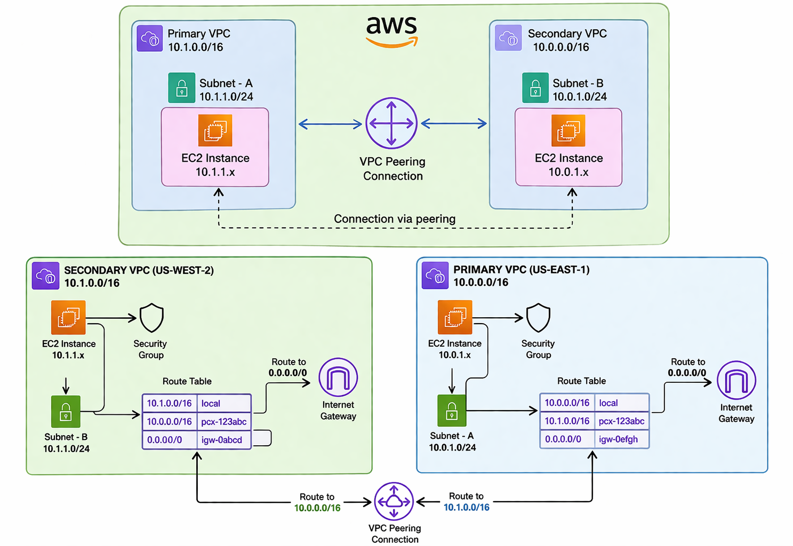
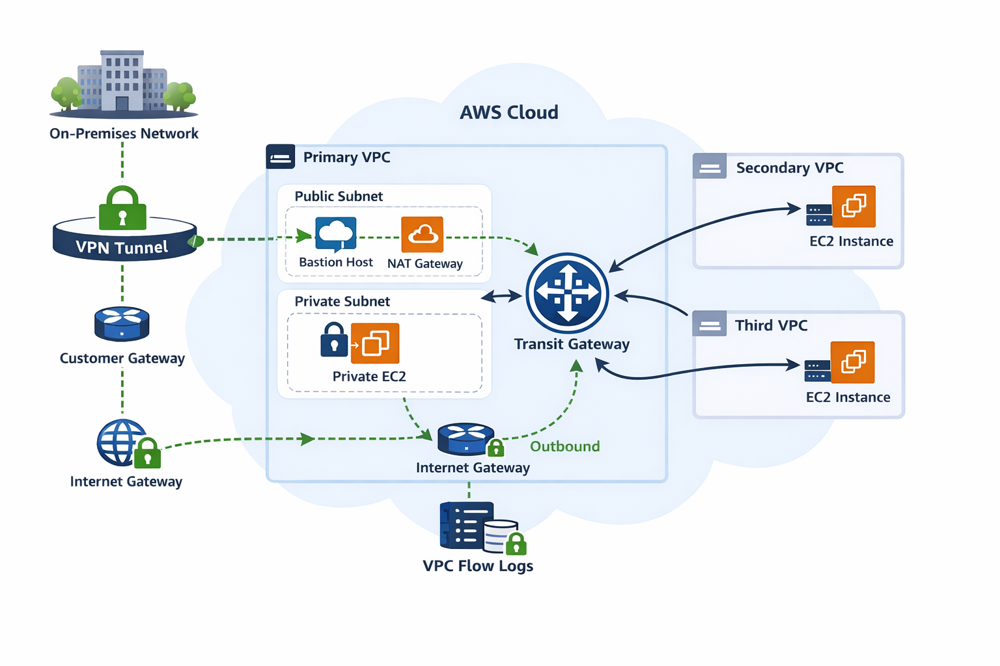
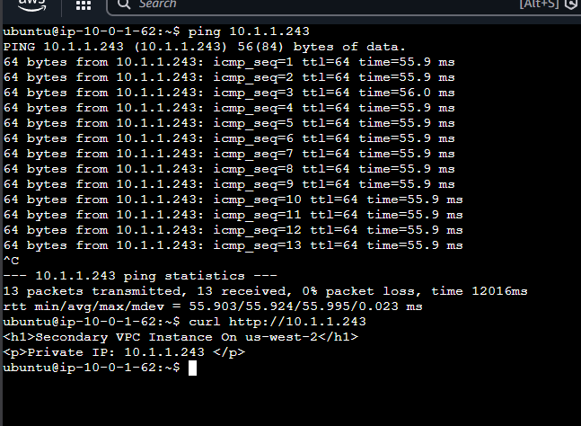
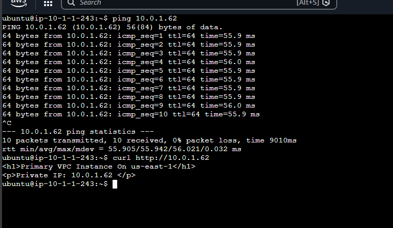
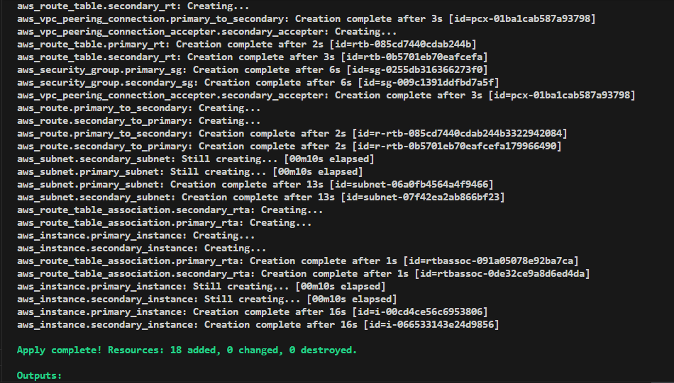
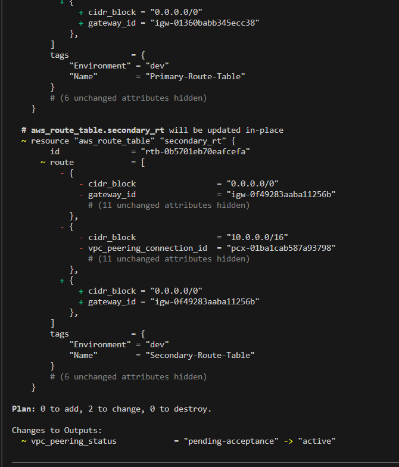
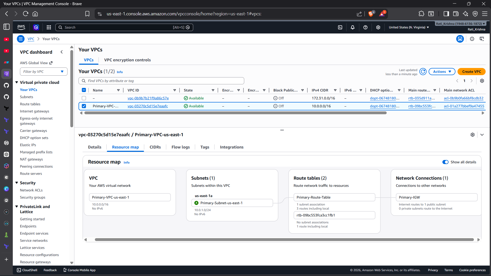
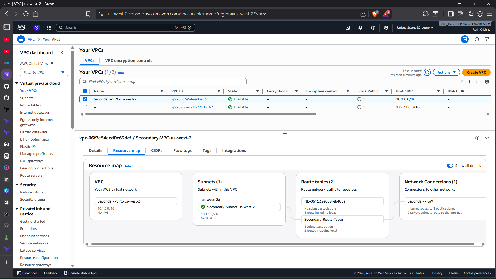

# VPC and Peering (Mini Project 02)

## Overview
This project showcases **AWS VPC Peering** by creating two VPCs in different AWS regions and establishing a peering connection between them. This allows resources in both VPCs to communicate with each other using private IP addresses.

## 🏗️ Architecture
```
┌─────────────────────────────────────┐       ┌─────────────────────────────────────┐
│     Primary VPC (us-east-1)         │       │    Secondary VPC (us-west-2)        │
│     CIDR: 10.0.0.0/16               │       │    CIDR: 10.1.0.0/16                │
│                                     │       │                                     │
│  ┌───────────────────────────────┐  │       │  ┌───────────────────────────────┐  │
│  │  Subnet: 10.0.1.0/24          │  │       │  │  Subnet: 10.1.1.0/24          │  │
│  │  ┌─────────────────────────┐  │  │       │  │  ┌─────────────────────────┐  │  │
│  │  │  EC2 Instance           │  │  │       │  │  │  EC2 Instance           │  │  │
│  │  │  Private IP: 10.0.1.x   │  │  │       │  │  │  Private IP: 10.1.1.x   │  │  │
│  │  └─────────────────────────┘  │  │       │  │  └─────────────────────────┘  │  │
│  └───────────────────────────────┘  │       │  └───────────────────────────────┘  │
│                                     │       │                                     │
│  Internet Gateway                   │       │  Internet Gateway                   │
└─────────────────┬───────────────────┘       └─────────────────┬───────────────────┘
                  │                                             │
                  └───────────────VPC Peering───────────────────┘
```

### VPC Peering Architecture



### Final Production-Level Architecture (Extended)



---

## What This Project Creates

### Networking Components
1. **Two VPCs**:
   - Primary VPC in us-east-1 (10.0.0.0/16)
   - Secondary VPC in us-west-2 (10.1.0.0/16)

2. **Subnets**:
   - One public subnet in each VPC
   - Configured with auto-assign public IP

3. **Internet Gateways**:
   - One for each VPC to allow internet access

4. **Route Tables**:
   - Custom route tables with routes to internet and peered VPC
   - Routes for VPC peering traffic

5. **VPC Peering Connection**:
   - Cross-region peering between the two VPCs
   - Automatic acceptance configured

### Compute Resources
1. **EC2 Instances**:
   - One t2.micro instance in each VPC
   - Running Amazon Linux 2
   - Apache web server installed
   - Custom web page showing VPC information

2. **Security Groups**:
   - SSH access from anywhere (port 22)
   - ICMP (ping) allowed from peered VPC
   - All TCP traffic allowed between VPCs

## Prerequisites

1. **AWS Account** with appropriate permissions
2. **AWS CLI** configured with credentials
3. **Terraform** installed (version >= 1.0)
4. **SSH Key Pair** created in both regions (use the same name)

### Creating SSH Key Pairs
```bash
# For us-east-1
aws ec2 create-key-pair --key-name vpc-peering --region us-east-1 --query 'KeyMaterial' --output text > vpc-peering.pem

# For us-west-2
aws ec2 create-key-pair --key-name vpc-peering --region us-west-2 --query 'KeyMaterial' --output text > vpc-peering-west.pem

# Set permissions (on Linux/Mac)
chmod 400 vpc-peering.pem
```

## Setup Instructions

### 1. Clone and Navigate
```bash
cd terraform_projects/02_mini_project
```

### 2. Configure Variables
Copy the example tfvars file and update it:
```bash
cp terraform.tfvars.example terraform.tfvars
```

Edit `terraform.tfvars` and add your key pair name:
```hcl
key_name = "vpc-peering"
```

### 3. Initialize Terraform
```bash
terraform init
```

### 4. Review the Plan
```bash
terraform plan
```

### 5. Apply the Configuration
```bash
terraform apply
```

Type `yes` when prompted.

## Testing VPC Peering

After the infrastructure is created, you can test the VPC peering connection:

### 1. Get Instance IPs
```bash
terraform output
```

### 2. Test Connectivity from Primary to Secondary
```bash
# SSH into Primary instance
ssh -i vpc-peering.pem ec2-user@<PRIMARY_PUBLIC_IP>

# Ping the Secondary instance using its private IP
ping <SECONDARY_PRIVATE_IP>

# Test HTTP connectivity
curl http://<SECONDARY_PRIVATE_IP>
```

### 3. Test Connectivity from Secondary to Primary
```bash
# SSH into Secondary instance
ssh -i vpc-peering.pem ec2-user@<SECONDARY_PUBLIC_IP>

# Ping the Primary instance using its private IP
ping <PRIMARY_PRIVATE_IP>

# Test HTTP connectivity
curl http://<PRIMARY_PRIVATE_IP>
```

## Key Concepts Demonstrated

### 1. VPC Peering
- Cross-region VPC peering connection
- Peering connection requester and accepter
- Automatic acceptance configuration

### 2. Routing
- Route tables with peering routes
- Traffic routing between VPCs
- Internet gateway routes

### 3. Security
- Security groups allowing cross-VPC traffic
- ICMP and TCP rules
- Proper egress rules

### 4. Multi-Region Deployment
- Using provider aliases for different regions
- Cross-region resource dependencies
- Regional AMI selection

## Important Notes

### CIDR Blocks
- VPC CIDR blocks **must not overlap** for peering to work
- Primary VPC: 10.0.0.0/16
- Secondary VPC: 10.1.0.0/16

### Costs
This project creates resources that incur AWS charges:
- EC2 instances (t3.micro)
- Data transfer between regions
- VPC peering data transfer

**Remember to destroy resources when done:**
```bash
terraform destroy
```

### Limitations
- VPC peering is **not transitive** (if A peers with B, and B peers with C, A cannot communicate with C)
- VPC peering does not support **edge-to-edge routing**
- Maximum of **125** peering connections per VPC

## Troubleshooting

### Cannot Connect Between Instances
1. Check security groups allow traffic from the peered VPC CIDR
2. Verify route tables have routes to the peered VPC
3. Ensure VPC peering connection is in "active" state
4. Check NACL rules (if configured)

### Peering Connection Not Accepting
1. Ensure auto_accept is set to true in accepter resource
2. Check IAM permissions for cross-region operations
3. Verify VPC CIDR blocks don't overlap

### SSH Connection Issues
1. Verify key pair exists in the correct region
2. Check security group allows SSH (port 22)
3. Ensure instance has a public IP address
4. Verify internet gateway and route table configuration

## Cleanup

To avoid ongoing charges, destroy all resources:
```bash
terraform destroy
```

Type `yes` when prompted. This will remove:
- EC2 instances
- VPC peering connection
- Security groups
- Route tables
- Subnets
- Internet gateways
- VPCs

## Learning Outcomes

After completing this project, you will understand:
1. How to create VPC peering connections between regions
2. How to configure routing for VPC peering
3. How to set up security groups for cross-VPC communication
4. How to use Terraform provider aliases for multi-region deployments
5. How to test and verify VPC peering connectivity

## Additional Resources

- [AWS VPC Peering Documentation](https://docs.aws.amazon.com/vpc/latest/peering/)
- [Terraform AWS Provider](https://registry.terraform.io/providers/hashicorp/aws/latest/docs)
- [VPC Peering Best Practices](https://docs.aws.amazon.com/vpc/latest/peering/vpc-peering-basics.html)

## 🧪 Testing Results

### 🔹 Primary → Secondary Connectivity



✔ Successful ICMP (Ping)
✔ HTTP response received

---

### 🔹 Secondary → Primary Connectivity



✔ Successful ICMP (Ping)
✔ HTTP response received

---

### 🔹 Terraform Apply Output




✔ Infrastructure successfully created
✔ No errors during deployment

---

### 🔹 AWS Console (VPC Resources)





✔ Resources verified in AWS Console
✔ Route tables and subnets correctly configured

## Next Steps

To extend this project, you could:
1. Add more subnets (private subnets)
2. Implement NAT gateways
3. Add VPC Flow Logs for traffic analysis
4. Create additional EC2 instances
5. Set up a VPN connection
6. Implement Transit Gateway for complex topologies

## 🚀 Extended Implementation (Advanced Architecture)

To enhance this project towards a **production-ready architecture**, the following components were implemented:

---

## 🔐 1. Private Subnet & NAT Gateway

* A **private subnet** in the Primary VPC
* A **NAT Gateway** in the public subnet
* A dedicated **route table for private subnet**

### Why:

* To improve security by removing direct public access to application instances
* To allow private instances to access the internet for updates and package installation

### Architecture Flow:

```
Private EC2 → NAT Gateway → Internet Gateway → Internet
```

### Key Learning:

* NAT Gateway is always placed in a **public subnet**
* Private instances use NAT for outbound traffic only

---

## 🖥️ 2. Additional EC2 Instance (Private)

* A new EC2 instance inside the **private subnet**
* No public IP assigned

### Why:

* To simulate **secure production environments**
* Demonstrates **bastion host pattern**

### Access Pattern:

```
Local Machine → Public EC2 (Bastion) → Private EC2
```

---

## 📊 3. VPC Flow Logs

* Enabled **VPC Flow Logs**
* Logs stored in **CloudWatch**
* IAM Role and Policy for log delivery

### Why:

* To monitor network traffic
* To debug connectivity issues
* To improve security visibility

### Key Learning:

* Flow logs help identify **ACCEPT / REJECT traffic**
* Useful for troubleshooting and auditing

---

## 🌐 4. Transit Gateway

* Created a **Transit Gateway (TGW)**
* Attached multiple VPCs (Primary, Secondary, Third)
* Updated route tables for TGW routing

### Why:

* To overcome VPC peering limitations
* To enable **transitive connectivity**

### Architecture:

```
        Transit Gateway
       /      |       \
   VPC-A    VPC-B    VPC-C
```

### Key Learning:

* TGW acts as a **central hub**
* Simplifies multi-VPC communication

---

## 🔐 5. Site-to-Site VPN (Simulation)

* Customer Gateway (represents on-prem network)
* Virtual Private Gateway (AWS side)
* VPN Connection
* Route configuration

### Why:

* To simulate **hybrid cloud architecture**
* To connect on-premise network with AWS securely

### Architecture Flow:

```
On-Prem Network → Customer Gateway → VPN Tunnel → VGW → VPC
```

### Important Note:

* This setup creates only **VPN infrastructure**
* Actual VPN connection requires real on-premise router/firewall

---

## 🧠 Final Architecture Overview

This project now includes:

* Multi-VPC architecture
* Private & public subnet design
* Secure outbound internet via NAT
* Centralized routing using Transit Gateway
* Traffic monitoring with Flow Logs
* Hybrid connectivity simulation using VPN

---

## 🎯 Learning Outcomes (Extended)

After completing this extended setup, you will understand:

1. How to design **secure VPC architectures using private subnets**
2. How NAT Gateway enables controlled internet access
3. How to monitor traffic using VPC Flow Logs
4. How to scale networking using Transit Gateway
5. How hybrid cloud connectivity works using VPN
6. Real-world architecture patterns used in production systems

---