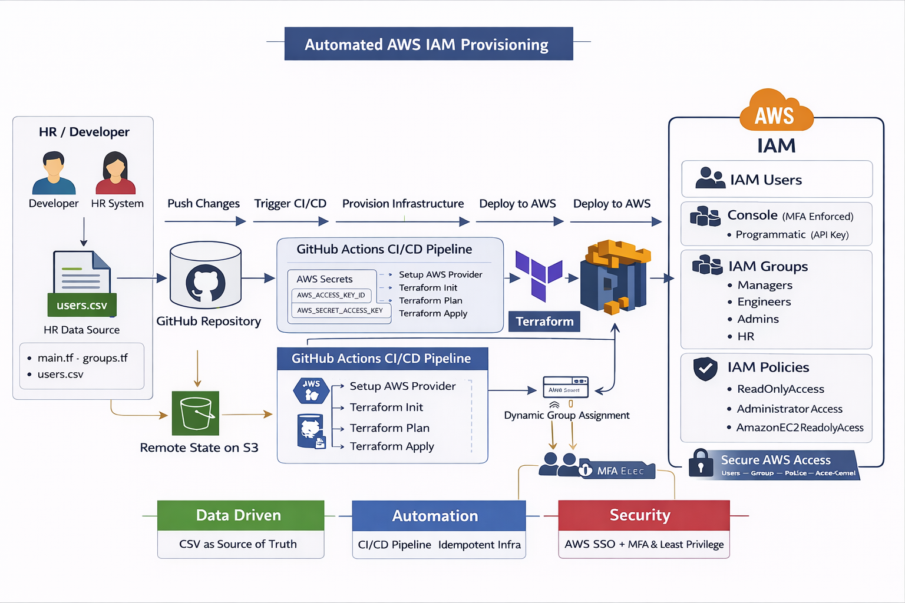

# AWS IAM User Management with Terraform (Mini Project 03)

## Overview
This project demonstrates how to manage AWS IAM users, groups, and group memberships using Terraform and a CSV file as the data source. It's an AWS equivalent of Azure AD user management.

## What Gets Created

- **26 IAM Users** with console access
- **3 IAM Groups** (Education, Managers, Engineers)
- **Group Memberships** based on user attributes
- **User Tags** with metadata (DisplayName, Department, JobTitle)

## Prerequisites

1. **AWS CLI** configured with credentials
2. **Terraform** v1.0 or later
3. **AWS Permissions**: IAM user creation and management permissions
4. **S3 Bucket** for Terraform state (see setup below)

## 🏗️ Architecture



## Quick Start

### 1. Create S3 Backend Bucket

```
aws s3 mb s3://my-terraform-state-bucket-krishna --region us-east-1
aws s3api put-bucket-versioning --bucket my-terraform-state-bucket-krishna --versioning-configuration Status=Enabled
```

### 2. Initialize Terraform

```
terraform init
```

### 3. Review Changes

```
terraform plan
```

### 4. Apply Configuration

```
terraform apply -auto-approve
```

### 5. Verify in AWS Console

Go to [IAM Console](https://console.aws.amazon.com/iam/) and check:
- **Users** section - 26 users created
- **User groups** section - 3 groups with members

## File Structure

```
03_mini_project/
├── images/
│   ├── IAM_Full_Diagram.png  # Full Architecture Diagram
├── .github/workflows/
│   ├── terraform-apply.yml # CI/CD Pipeline triggered for any change in users.csv
├── backend.tf          # S3 backend configuration
├── provider.tf         # AWS provider setup
├── versions.tf         # Terraform and provider versions
├── main.tf            # User creation and CSV parsing
├── groups.tf          # Group and membership management
├── locals.tf          # Local values
├── mfa.tf             # MFA policy
├── users.csv          # User data source
├── output.tf          # Output values
├── Interview.md       # Interview Questions
└── README.md          # This file
```

## How It Works

### Step 1: Read CSV File
### Step 2: Create IAM Users
Users are created with a username format: `{first_initial}{lastname}` (e.g., `sjinwoo`):

### Step 3: Enable Console Access
Login profiles are created for console access with password reset required:

### Step 4: Create Groups and Memberships
Groups are created and users are dynamically assigned based on their department:

## Outputs
After applying, you can view the outputs:

## User List
The following users are created from `users.csv`:

| Username | Full Name | Department | Job Title | email | location | access_level |
|----------|-----------|------------|-----------|-------|----------|--------------|
| sjinwoo | Sung Jinwoo | Accounting | Accountant | [EMAIL_ADDRESS] | South Korea | read |
| ... and 24 more users |

## Groups and Memberships

## Education Group
## Managers Group
## Engineers Group

### Add More Users

Edit `users.csv` and add new rows:

```csv
first_name,last_name,department,job_title,email,location,access_level
Levi,Ackerman,Warehouse,Warehouse Foreman,levi@company.com,Germany,read
```

Then run:

```
terraform apply
```

### Add IAM Policies to Groups

## Password Management

AWS doesn't return auto-generated passwords without PGP encryption. To set passwords:

### Option 1: AWS Console
1. Go to IAM Console
2. Select a user
3. Click "Security credentials"
4. Click "Enable console access" or "Manage console access"
5. Set a password

### Option 2: AWS CLI

```
aws iam create-login-profile --user-name mscott --password "TempPassword123!" --password-reset-required
```

## Cleanup

To remove all created resources:

```
terraform destroy
```

**Warning:** This will delete all users, groups, and memberships.

## Troubleshooting

### Error: Backend Access Denied

Check your AWS credentials:

```
aws sts get-caller-identity
```

### Error: User Already Exists

Import existing user into state:

```
terraform import aws_iam_user.users[\"Sung\"] sjinwoo
```

Or delete the existing user:

```
aws iam delete-login-profile --user-name sjinwoo
aws iam delete-user --user-name sjinwoo
```

### View Terraform State

```
terraform state list
terraform state show aws_iam_user.users[\"Sung\"]
```

## Best Practices

✅ **Use Remote State** - S3 backend with versioning enabled  
✅ **Consistent Naming** - Lowercase usernames with predictable format  
✅ **Metadata as Tags** - Store user attributes as searchable tags  
✅ **Password Reset** - Force password change on first login  
✅ **Data-Driven** - CSV file as single source of truth  
✅ **Idempotent** - Safe to run multiple times  

## Security Considerations

⚠️ **Important:**
- Users require password reset on first login
- Consider implementing MFA requirements
- Review IAM policies before attaching to groups
- Don't commit `terraform.tfstate` to version control
- Use AWS SSO for production environments
- Enable CloudTrail for audit logging

## Next Steps

1. **Add IAM Policies** - Attach appropriate policies to groups
2. **Enable MFA** - Require multi-factor authentication
3. **Set Up AWS SSO** - For better user management in production
4. **Add More Attributes** - Extend CSV with email, phone, etc.
5. **Automate Onboarding** - Integrate with HR systems ( Optional )

## Resources

- [Terraform AWS Provider Docs](https://registry.terraform.io/providers/hashicorp/aws/latest/docs)
- [AWS IAM Best Practices](https://docs.aws.amazon.com/IAM/latest/UserGuide/best-practices.html)
- [Terraform Functions](https://www.terraform.io/language/functions)

Your AWS IAM infrastructure is now managed as code. You can:
- Add new users by editing the CSV
- Modify group memberships by changing user attributes
- Version control all changes
- Replicate this setup across multiple AWS accounts

## 🚀 Advanced Features Implemented

### 🔐 IAM Policy Management
- Attached AWS managed policies to groups (ReadOnly, Admin, EC2 access)
- Implemented Role-Based Access Control (RBAC)

### 🔐 MFA Enforcement
- Enforced Multi-Factor Authentication using IAM policy
- Denies access if MFA is not enabled

### ⚙️ CI/CD Automation
- Integrated GitHub Actions for Terraform automation
- Automatically provisions infrastructure on CSV/code changes

### 📊 Extended User Attributes
- Added email, location, and access level fields in CSV
- Enabled dynamic access control using AccessLevel

### 🧠 Dynamic Group Assignment
- Users assigned to groups based on tags (Department, AccessLevel)
- Eliminated hardcoded logic

## ⚙️ CI/CD Workflow

This project uses GitHub Actions to automate Terraform execution.

### Workflow:
1. Developer updates `users.csv` or Terraform files
2. Changes are pushed to GitHub
3. GitHub Actions pipeline is triggered
4. Terraform runs:
   - terraform init
   - terraform plan
   - terraform apply
5. AWS IAM resources are updated automatically

### Benefits:
- Fully automated onboarding
- No manual Terraform execution
- Consistent infrastructure deployment

## 🔐 Security Enhancements

- MFA enforcement using IAM policy
- Least privilege access using group-based policies
- No hardcoded credentials (used GitHub Secrets)
- Password reset enforced on first login
- Recommended migration to AWS SSO for production

## 🏢 Production Considerations

- Replace IAM Users with AWS Identity Center (SSO)
- Use IAM Roles instead of access keys
- Integrate with real HR systems (Workday, SAP)
- Implement approval workflow in CI/CD
- Enable CloudTrail for auditing

## Success! ✅
Happy Terraforming! 🚀